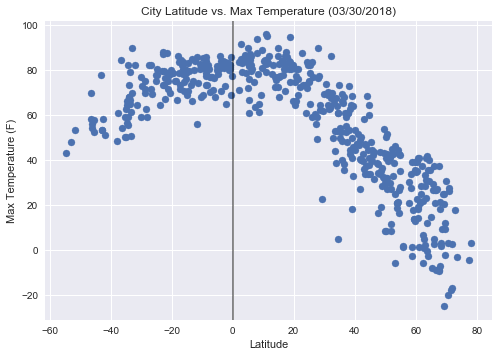
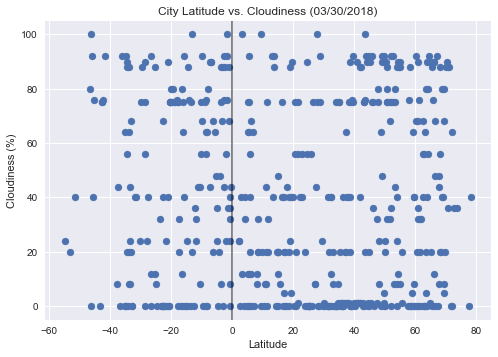
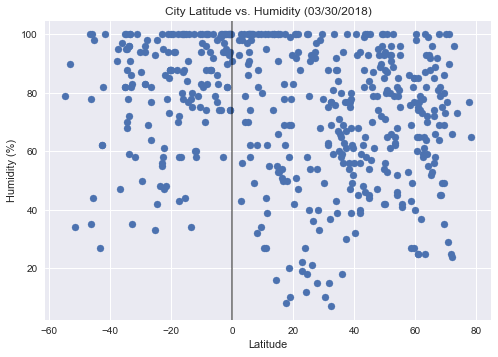
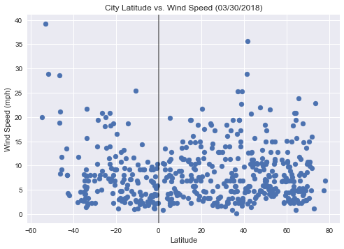

# What is the Weather Like?  WeatherPy

## Background

Create a Python script to visualize the weather of 500+ cities across the world of varying distance from the equator.

The objective is to build a series of scatter plots to showcase the following relationships:

* Temperature (F) vs. Latitude
* Humidity (%) vs. Latitude
* Cloudiness (%) vs. Latitude
* Wind Speed (mph) vs. Latitude

## Observable Trends and Description:

### 1. LATITUDE vs MAX TEMPERATURE
Most of the max temperatures (60-95deg F) are happen around the equator. The lowest temperatures belong to the northern parts of the world.

### 2. LATITUDE vs CLOUDINESS
The cloudiness is pretty evenly spread out all over the world for this day.

### 3. LATITUDE vs HUMIDITY
The evenly spread out cloudiness correlates with the pretty evenly spread out humidity, 30 – 100%, with the ‘dry’ area of 2 – 30% on the Lat 15 – 40 deg.

### 4. LATITUDE vs WIND SPEED
This day is relatively calm everywhere in terms of wind speed, mostly in range of 3 – 15 mph, with some areas of 25 – 40 mph.

#### Tools used: Python, APIs, JSON, Matplotlib and Seaborn libraries.
